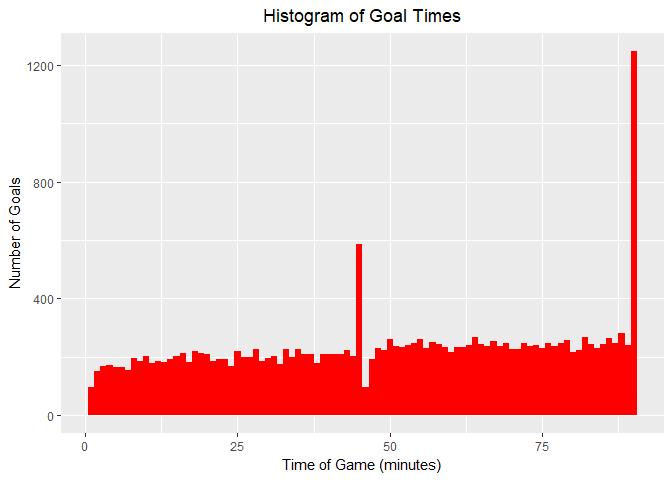
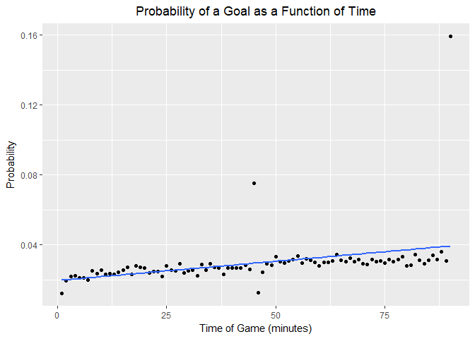
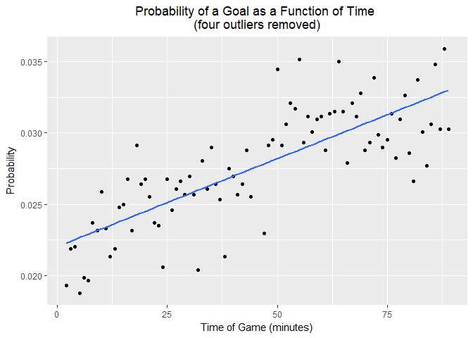

# Football Goal Time Probability Distribution
Andrew Kinsman  
24 March 2017  


```r
library(tidyverse)
```

```
## Loading tidyverse: ggplot2
## Loading tidyverse: tibble
## Loading tidyverse: tidyr
## Loading tidyverse: readr
## Loading tidyverse: purrr
## Loading tidyverse: dplyr
```

```
## Conflicts with tidy packages ----------------------------------------------
```

```
## filter(): dplyr, stats
## lag():    dplyr, stats
```

### DATA PREPARATION ###


```r
# Import data
minutes <- read_csv("minutes.csv")
```

```
## Parsed with column specification:
## cols(
##   conceding_team = col_character(),
##   date = col_date(format = ""),
##   minute = col_integer(),
##   scoring_team = col_character()
## )
```

```r
dim(minutes)  # 20785 observations of 4 variables 
```

```
## [1] 20785     4
```

```r
str(minutes)
```

```
## Classes 'tbl_df', 'tbl' and 'data.frame':	20785 obs. of  4 variables:
##  $ conceding_team: chr  "Norwich City" "Norwich City" "Norwich City" "Norwich City" ...
##  $ date          : Date, format: "2012-08-18" "2012-08-18" ...
##  $ minute        : int  26 41 54 66 87 55 76 80 8 53 ...
##  $ scoring_team  : chr  "Fulham" "Fulham" "Fulham" "Fulham" ...
##  - attr(*, "spec")=List of 2
##   ..$ cols   :List of 4
##   .. ..$ conceding_team: list()
##   .. .. ..- attr(*, "class")= chr  "collector_character" "collector"
##   .. ..$ date          :List of 1
##   .. .. ..$ format: chr ""
##   .. .. ..- attr(*, "class")= chr  "collector_date" "collector"
##   .. ..$ minute        : list()
##   .. .. ..- attr(*, "class")= chr  "collector_integer" "collector"
##   .. ..$ scoring_team  : list()
##   .. .. ..- attr(*, "class")= chr  "collector_character" "collector"
##   ..$ default: list()
##   .. ..- attr(*, "class")= chr  "collector_guess" "collector"
##   ..- attr(*, "class")= chr "col_spec"
```

```r
glimpse(minutes)
```

```
## Observations: 20,785
## Variables: 4
## $ conceding_team <chr> "Norwich City", "Norwich City", "Norwich City",...
## $ date           <date> 2012-08-18, 2012-08-18, 2012-08-18, 2012-08-18...
## $ minute         <int> 26, 41, 54, 66, 87, 55, 76, 80, 8, 53, 63, 71, ...
## $ scoring_team   <chr> "Fulham", "Fulham", "Fulham", "Fulham", "Fulham...
```

```r
summary(minutes)
```

```
##  conceding_team          date                minute     
##  Length:20785       Min.   :2012-08-03   Min.   : 1.00  
##  Class :character   1st Qu.:2013-03-09   1st Qu.:28.00  
##  Mode  :character   Median :2013-12-29   Median :52.00  
##                     Mean   :2013-12-28   Mean   :50.53  
##                     3rd Qu.:2014-10-19   3rd Qu.:73.00  
##                     Max.   :2015-05-31   Max.   :90.00  
##  scoring_team      
##  Length:20785      
##  Class :character  
##  Mode  :character  
##                    
##                    
## 
```

```r
results <- read_csv("results.csv")
```

```
## Parsed with column specification:
## cols(
##   home_team = col_character(),
##   away_team = col_character(),
##   home_goals = col_integer(),
##   away_goals = col_integer(),
##   date = col_date(format = "")
## )
```

```r
dim(results)  # 7842 observations of 6 variables
```

```
## [1] 7842    5
```

```r
game_ID <- 1:nrow(results)  # add game_ID for later convenience
results <- cbind(game_ID, results)
str(results)
```

```
## 'data.frame':	7842 obs. of  6 variables:
##  $ game_ID   : int  1 2 3 4 5 6 7 8 9 10 ...
##  $ home_team : chr  "Fulham" "Newcastle United" "QPR" "West Bromwich Albion" ...
##  $ away_team : chr  "Norwich City" "Tottenham Hotspur" "Swansea" "Liverpool" ...
##  $ home_goals: int  5 2 0 3 1 0 0 3 1 3 ...
##  $ away_goals: int  0 1 5 0 0 2 0 0 1 1 ...
##  $ date      : Date, format: "2012-08-18" "2012-08-18" ...
```

```r
glimpse(results)
```

```
## Observations: 7,842
## Variables: 6
## $ game_ID    <int> 1, 2, 3, 4, 5, 6, 7, 8, 9, 10, 11, 12, 13, 14, 15, ...
## $ home_team  <chr> "Fulham", "Newcastle United", "QPR", "West Bromwich...
## $ away_team  <chr> "Norwich City", "Tottenham Hotspur", "Swansea", "Li...
## $ home_goals <int> 5, 2, 0, 3, 1, 0, 0, 3, 1, 3, 0, 1, 2, 1, 2, 3, 2, ...
## $ away_goals <int> 0, 1, 5, 0, 0, 2, 0, 0, 1, 1, 2, 1, 2, 1, 0, 0, 2, ...
## $ date       <date> 2012-08-18, 2012-08-18, 2012-08-18, 2012-08-18, 20...
```

```r
summary(results)
```

```
##     game_ID      home_team          away_team           home_goals   
##  Min.   :   1   Length:7842        Length:7842        Min.   :0.000  
##  1st Qu.:1961   Class :character   Class :character   1st Qu.:1.000  
##  Median :3922   Mode  :character   Mode  :character   Median :1.000  
##  Mean   :3922                                         Mean   :1.481  
##  3rd Qu.:5882                                         3rd Qu.:2.000  
##  Max.   :7842                                         Max.   :9.000  
##    away_goals        date           
##  Min.   :0.00   Min.   :2012-08-03  
##  1st Qu.:0.00   1st Qu.:2013-03-10  
##  Median :1.00   Median :2014-01-01  
##  Mean   :1.17   Mean   :2014-01-02  
##  3rd Qu.:2.00   3rd Qu.:2014-10-25  
##  Max.   :8.00   Max.   :2015-05-31
```

```r
# Save nil-nils for later
results_nil_nil <- results %>% filter(home_goals + away_goals == 0)
str(results_nil_nil)  # 629 nil-nils
```

```
## 'data.frame':	629 obs. of  6 variables:
##  $ game_ID   : int  7 18 44 55 75 96 100 106 120 146 ...
##  $ home_team : chr  "Stoke City" "QPR" "West Bromwich Albion" "Norwich City" ...
##  $ away_team : chr  "Arsenal" "Chelsea" "West Ham United" "Newcastle United" ...
##  $ home_goals: int  0 0 0 0 0 0 0 0 0 0 ...
##  $ away_goals: int  0 0 0 0 0 0 0 0 0 0 ...
##  $ date      : Date, format: "2012-08-26" "2012-09-15" ...
```

```r
# Merge datasets
goaltime_h <- minutes %>% left_join(results, by = c(date = "date", conceding_team = "away_team", 
    scoring_team = "home_team"))
goaltime_h$home_team <- ifelse(is.na(goaltime_h$home_goals), goaltime_h$conceding_team, 
    goaltime_h$scoring_team)
goaltime_h$away_team <- ifelse(is.na(goaltime_h$home_goals), goaltime_h$scoring_team, 
    goaltime_h$conceding_team)

goaltime_a <- minutes %>% left_join(results, by = c(date = "date", conceding_team = "home_team", 
    scoring_team = "away_team"))

goaltime <- data.frame(goaltime_a$game_ID, goaltime_h, goaltime_a$home_goals, 
    goaltime_a$away_goals)

goaltime[is.na(goaltime)] = ""
goaltime <- unite(goaltime, game_ID, goaltime_a.game_ID, game_ID, sep = "")
goaltime <- unite(goaltime, home_goals, home_goals, goaltime_a.home_goals, 
    sep = "")
goaltime <- unite(goaltime, away_goals, away_goals, goaltime_a.away_goals, 
    sep = "")

# Convert appropriate columns to integers
goaltime$game_ID <- as.integer(goaltime$game_ID)
goaltime$home_goals <- as.integer(goaltime$home_goals)
goaltime$away_goals <- as.integer(goaltime$away_goals)
goaltime$minute <- as.integer(goaltime$minute)

# Add nil-nils
length(unique(goaltime$game_ID))  # 7212 as missing nil-nils so need to bring those in from earlier saved 
```

```
## [1] 7212
```

```r
# data frame
results_nil_nil$conceding_team <- NA
results_nil_nil$scoring_team <- NA
results_nil_nil$minute <- NA
goaltime <- rbind(goaltime, results_nil_nil)
length(unique(goaltime$game_ID))  # 7841
```

```
## [1] 7841
```

```r
# But this doesn't match up with the 7842 observations in the
# results.csv
setdiff(results$game_ID, goaltime$game_ID)  # game 4642 is in results.csv but not in minutes.csv
```

```
## [1] 4642
```

```r
results[results$game_ID == 4642, ]
```

```
##      game_ID home_team away_team home_goals away_goals       date
## 4642    4642  Cagliari   AS Roma          0          3 2012-09-23
```

```r
# game_ID home_team away_team home_goals away_goals date 4642 4642
# Cagliari AS Roma 0 3 2012-09-23

# Confirm that this game is missing from the minutes.csv:
minutes[minutes$date == "2012-09-23" & minutes$conceding_team == "Cagliari", 
    ]
```

```
## # A tibble: 0 × 4
## # ... with 4 variables: conceding_team <chr>, date <date>, minute <int>,
## #   scoring_team <chr>
```

```r
# Check total number of goals between results.csv and the new goaltime
# dataframe
goaltime <- goaltime %>% mutate(total_goals = home_goals + away_goals)

results <- results %>% mutate(total_goals = home_goals + away_goals)
sum(results$total_goals[-4642])  # 20781 total goals in results.csv (excluding game_ID 4642, for which 
```

```
## [1] 20781
```

```r
# minutes data were not provided)

goals_total <- goaltime %>% group_by(game_ID) %>% summarise(n = n(), sum_goals = sum(total_goals)/n)
sum(goals_total$sum_goals)  # 20781 which matches up with the results.csv total goals (see above)
```

```
## [1] 20781
```

```r
# However, there 20785 rather than 20781 goals in minutes.csv, which is
# discussed in the accompanying report. If required, duplicated
# goaltimes can be checked using
head(goaltime[duplicated(goaltime), ])
```

```
##      game_ID    conceding_team       date minute         scoring_team
## 740      257 Tottenham Hotspur 2012-12-09     90              Everton
## 1062     380 Manchester United 2013-05-19     81 West Bromwich Albion
## 1262     442       Southampton 2014-04-05     45      Manchester City
## 2820    1026               QPR 2014-10-19     90            Liverpool
## 3598    1329      Leeds United 2012-11-10     90              Watford
## 3844    1419      Bristol City 2012-09-15     90     Blackburn Rovers
##      home_goals away_goals            home_team         away_team
## 740           2          1              Everton Tottenham Hotspur
## 1062          5          5 West Bromwich Albion Manchester United
## 1262          4          1      Manchester City       Southampton
## 2820          2          3                  QPR         Liverpool
## 3598          1          6         Leeds United           Watford
## 3844          3          5         Bristol City  Blackburn Rovers
##      total_goals
## 740            3
## 1062          10
## 1262           5
## 2820           5
## 3598           7
## 3844           8
```

### EXPLORATORY DATA ANALYSIS AND "NAIVE" MODEL ### 


```r
# Naive prediction of a goal in any given minute (excluding game_ID
# 4642) based on results.csv; this assumes that goals are scored at a
# constant rate over time.
sum(results$total_goals[-4642])/(nrow(results) - 1)/90  # 0.0294 (20781/7841/90)
```

```
## [1] 0.02944777
```

```r
# this is precisely equivalent to
sum(goals_total$sum_goals)/length(unique(goaltime$game_ID))/90
```

```
## [1] 0.02944777
```

```r
# However, we shall base our 'naive' prediction on the 20785 figure
# from the minutes.csv rather than the 20781 figure from results.csv:
pred_naive <- nrow(minutes)/(nrow(results) - 1)/90
pred_naive  # 0.0295
```

```
## [1] 0.02945344
```

```r
# Plot distribution of goal times
ggplot(goaltime, aes(x = minute)) + geom_histogram(bins = 90, fill = "red") + 
    theme(plot.title = element_text(hjust = 0.5)) + ggtitle("Histogram of Goal Times") + 
    xlab("Time of Game (minutes)") + ylab("Number of Goals")
```

<!-- -->

```r
# Most common and least common times for goals
goaltime[complete.cases(goaltime$minute), ] %>% count(minute) %>% mutate(prob = (n/(nrow(results) - 
    1))) %>% arrange(desc(n))
```

```
## # A tibble: 90 × 3
##    minute     n       prob
##     <int> <int>      <dbl>
## 1      90  1249 0.15929091
## 2      45   588 0.07499043
## 3      88   282 0.03596480
## 4      64   268 0.03417931
## 5      82   268 0.03417931
## 6      86   265 0.03379671
## 7      55   262 0.03341411
## 8      50   261 0.03328657
## 9      79   259 0.03303150
## 10     67   253 0.03226629
## # ... with 80 more rows
```

```r
goaltime[complete.cases(goaltime$minute), ] %>% count(minute) %>% mutate(prob = (n/(nrow(results) - 
    1))) %>% arrange(n)
```

```
## # A tibble: 90 × 3
##    minute     n       prob
##     <int> <int>      <dbl>
## 1       1    95 0.01211580
## 2      46    98 0.01249841
## 3       2   152 0.01938528
## 4       7   154 0.01964035
## 5       6   164 0.02091570
## 6       5   166 0.02117077
## 7       3   170 0.02168091
## 8      24   170 0.02168091
## 9       4   173 0.02206351
## 10     32   174 0.02219105
## # ... with 80 more rows
```

```r
goals <- goaltime %>% count(minute) %>% mutate(prob = (n/(nrow(results) - 
    1)))
dim(goals)  # 91 rows (including NAs for 0-0)
```

```
## [1] 91  3
```

```r
sum(goals$n[complete.cases(goals[goals$minute, ])])  # 20785 goals (four more than in the corrected results 
```

```
## [1] 20785
```

```r
# data - see above)

# Probability of a 0-0 draw:
goals$prob[is.na(goals$minute)]  # 0.08021936
```

```
## [1] 0.08021936
```

```r
# Goals per game
sum(goals$prob[1:90])  # 2.65081
```

```
## [1] 2.65081
```

```r
mean(goaltime$total_goals[!duplicated(goaltime$game_ID)])  # 2.6503 
```

```
## [1] 2.6503
```

```r
# Variance
var(goaltime$total_goals[!duplicated(goaltime$game_ID)])  # 2.7466
```

```
## [1] 2.746572
```

```r
# First half goals
sum(goals$prob[1:45])  # 1.157505
```

```
## [1] 1.157505
```

```r
# Second half goals
sum(goals$prob[46:90])  # 1.493304
```

```
## [1] 1.493304
```

```r
# Percentage of goals scored in second half
(sum(goals$prob[46:90])/sum(goals$prob[1:90])) * 100  # 56.33%
```

```
## [1] 56.33389
```

```r
# Remove nil-nils and plot (with smoothed regression line)
goals2 <- goals[complete.cases(goals), ]
ggplot(goals2, aes(x = minute, y = prob)) + geom_point() + stat_smooth(method = "lm", 
    se = 0) + theme(plot.title = element_text(hjust = 0.5)) + xlab("Time of Game (minutes)") + 
    ylab("Probability") + ggtitle("Probability of a Goal as a Function of Time")
```

<!-- -->

### LINEAR MODELLING ###


```r
# First we remove the nil-nils and game_ID 4642, and then we split the
# datat into a training set and a validation set.

# Remove nil-nils
goaltime2 <- goaltime[complete.cases(goaltime$minute), ]
# Split into training and validation set
results2 <- results[-4642, 1]  # exclude game_ID 4642 for which no goal times are available
library(caTools)
set.seed(180)  # set seed for reproducability
split <- sample.split(results2, SplitRatio = 0.7)  # randomly split using gameID 
train_vec <- subset(results2, split == TRUE)
val_vec <- subset(results2, split == FALSE)
# Use these splits on goaltime data
goaltime_train <- goaltime2 %>% filter(game_ID %in% train_vec)  # 14467 rows
goaltime_val <- goaltime2 %>% filter(game_ID %in% val_vec)  # 6318 rows

# Create counts and add probability column
goals_train <- goaltime_train %>% count(minute) %>% mutate(prob = n/(length(train_vec)))

goals_val <- goaltime_val %>% count(minute) %>% mutate(prob = n/(length(val_vec)))

# Build linear models
goals_lm <- lm(prob ~ minute, goals_train)
summary(goals_lm)  # R-squared of only 14%
```

```
## 
## Call:
## lm(formula = prob ~ minute, data = goals_train)
## 
## Residuals:
##       Min        1Q    Median        3Q       Max 
## -0.017011 -0.003942 -0.001066  0.001125  0.120600 
## 
## Coefficients:
##              Estimate Std. Error t value Pr(>|t|)    
## (Intercept) 1.915e-02  3.063e-03   6.254 1.41e-08 ***
## minute      2.228e-04  5.846e-05   3.811 0.000256 ***
## ---
## Signif. codes:  0 '***' 0.001 '**' 0.01 '*' 0.05 '.' 0.1 ' ' 1
## 
## Residual standard error: 0.01441 on 88 degrees of freedom
## Multiple R-squared:  0.1416,	Adjusted R-squared:  0.1319 
## F-statistic: 14.52 on 1 and 88 DF,  p-value: 0.0002563
```

```r
goals_train2 <- goals_train[-c(1, 45, 46, 90), ]
goals_lm2 <- lm(prob ~ minute, goals_train2)
summary(goals_lm2)  # R-squared of 61%
```

```
## 
## Call:
## lm(formula = prob ~ minute, data = goals_train2)
## 
## Residuals:
##        Min         1Q     Median         3Q        Max 
## -0.0055767 -0.0017751  0.0000377  0.0016685  0.0063528 
## 
## Coefficients:
##              Estimate Std. Error t value Pr(>|t|)    
## (Intercept) 2.205e-02  5.575e-04   39.55   <2e-16 ***
## minute      1.230e-04  1.067e-05   11.53   <2e-16 ***
## ---
## Signif. codes:  0 '***' 0.001 '**' 0.01 '*' 0.05 '.' 0.1 ' ' 1
## 
## Residual standard error: 0.002542 on 84 degrees of freedom
## Multiple R-squared:  0.6129,	Adjusted R-squared:  0.6083 
## F-statistic:   133 on 1 and 84 DF,  p-value: < 2.2e-16
```

```r
goals_lm2$fitted  # only 86 fitted values since minutes 1, 45, 46 & 90 are omitted; hence the first observation is minute 2 and observation 86 is minute 89 etc.
```

```
##          1          2          3          4          5          6 
## 0.02229361 0.02241665 0.02253969 0.02266274 0.02278578 0.02290882 
##          7          8          9         10         11         12 
## 0.02303186 0.02315490 0.02327795 0.02340099 0.02352403 0.02364707 
##         13         14         15         16         17         18 
## 0.02377012 0.02389316 0.02401620 0.02413924 0.02426228 0.02438533 
##         19         20         21         22         23         24 
## 0.02450837 0.02463141 0.02475445 0.02487749 0.02500054 0.02512358 
##         25         26         27         28         29         30 
## 0.02524662 0.02536966 0.02549271 0.02561575 0.02573879 0.02586183 
##         31         32         33         34         35         36 
## 0.02598487 0.02610792 0.02623096 0.02635400 0.02647704 0.02660008 
##         37         38         39         40         41         42 
## 0.02672313 0.02684617 0.02696921 0.02709225 0.02721529 0.02733834 
##         43         44         45         46         47         48 
## 0.02746138 0.02783051 0.02795355 0.02807659 0.02819963 0.02832267 
##         49         50         51         52         53         54 
## 0.02844572 0.02856876 0.02869180 0.02881484 0.02893788 0.02906093 
##         55         56         57         58         59         60 
## 0.02918397 0.02930701 0.02943005 0.02955309 0.02967614 0.02979918 
##         61         62         63         64         65         66 
## 0.02992222 0.03004526 0.03016831 0.03029135 0.03041439 0.03053743 
##         67         68         69         70         71         72 
## 0.03066047 0.03078352 0.03090656 0.03102960 0.03115264 0.03127568 
##         73         74         75         76         77         78 
## 0.03139873 0.03152177 0.03164481 0.03176785 0.03189090 0.03201394 
##         79         80         81         82         83         84 
## 0.03213698 0.03226002 0.03238306 0.03250611 0.03262915 0.03275219 
##         85         86 
## 0.03287523 0.03299827
```

```r
# Plot data with outliers removed
ggplot(goals_train2, aes(x = minute, y = prob)) + geom_point() + theme(plot.title = element_text(hjust = 0.5)) + 
    geom_smooth(method = "lm", se = 0) + xlab("Time of Game (minutes)") + 
    ylab("Probability") + ggtitle("Probability of a Goal as a Function of Time \n(four outliers removed)")
```

<!-- -->

```r
# Create indicator variables
goals_train$min_1 <- ifelse(goals_train$minute == 1, 1, 0)
goals_train$min_45 <- ifelse(goals_train$minute == 45, 1, 0)
goals_train$min_46 <- ifelse(goals_train$minute == 46, 1, 0)
goals_train$min_90 <- ifelse(goals_train$minute == 90, 1, 0)

goals_val$min_1 <- ifelse(goals_val$minute == 1, 1, 0)
goals_val$min_45 <- ifelse(goals_val$minute == 45, 1, 0)
goals_val$min_46 <- ifelse(goals_val$minute == 46, 1, 0)
goals_val$min_90 <- ifelse(goals_val$minute == 90, 1, 0)

goals_lm_final <- lm(prob ~ minute + min_1 + min_45 + min_46 + min_90, 
    goals_train)
summary(goals_lm_final)  # R-squared of 0.9745
```

```
## 
## Call:
## lm(formula = prob ~ minute + min_1 + min_45 + min_46 + min_90, 
##     data = goals_train)
## 
## Residuals:
##       Min        1Q    Median        3Q       Max 
## -0.005577 -0.001679  0.000000  0.001664  0.006353 
## 
## Coefficients:
##               Estimate Std. Error t value Pr(>|t|)    
## (Intercept)  2.205e-02  5.575e-04  39.548  < 2e-16 ***
## minute       1.230e-04  1.067e-05  11.533  < 2e-16 ***
## min_1       -1.014e-02  2.601e-03  -3.901 0.000193 ***
## min_45       4.676e-02  2.557e-03  18.287  < 2e-16 ***
## min_46      -1.532e-02  2.557e-03  -5.990 5.03e-08 ***
## min_90       1.267e-01  2.601e-03  48.711  < 2e-16 ***
## ---
## Signif. codes:  0 '***' 0.001 '**' 0.01 '*' 0.05 '.' 0.1 ' ' 1
## 
## Residual standard error: 0.002542 on 84 degrees of freedom
## Multiple R-squared:  0.9745,	Adjusted R-squared:  0.973 
## F-statistic: 641.8 on 5 and 84 DF,  p-value: < 2.2e-16
```

```r
goals_lm_final$fitted
```

```
##          1          2          3          4          5          6 
## 0.01202624 0.02229361 0.02241665 0.02253969 0.02266274 0.02278578 
##          7          8          9         10         11         12 
## 0.02290882 0.02303186 0.02315490 0.02327795 0.02340099 0.02352403 
##         13         14         15         16         17         18 
## 0.02364707 0.02377012 0.02389316 0.02401620 0.02413924 0.02426228 
##         19         20         21         22         23         24 
## 0.02438533 0.02450837 0.02463141 0.02475445 0.02487749 0.02500054 
##         25         26         27         28         29         30 
## 0.02512358 0.02524662 0.02536966 0.02549271 0.02561575 0.02573879 
##         31         32         33         34         35         36 
## 0.02586183 0.02598487 0.02610792 0.02623096 0.02635400 0.02647704 
##         37         38         39         40         41         42 
## 0.02660008 0.02672313 0.02684617 0.02696921 0.02709225 0.02721529 
##         43         44         45         46         47         48 
## 0.02733834 0.02746138 0.07434402 0.01239067 0.02783051 0.02795355 
##         49         50         51         52         53         54 
## 0.02807659 0.02819963 0.02832267 0.02844572 0.02856876 0.02869180 
##         55         56         57         58         59         60 
## 0.02881484 0.02893788 0.02906093 0.02918397 0.02930701 0.02943005 
##         61         62         63         64         65         66 
## 0.02955309 0.02967614 0.02979918 0.02992222 0.03004526 0.03016831 
##         67         68         69         70         71         72 
## 0.03029135 0.03041439 0.03053743 0.03066047 0.03078352 0.03090656 
##         73         74         75         76         77         78 
## 0.03102960 0.03115264 0.03127568 0.03139873 0.03152177 0.03164481 
##         79         80         81         82         83         84 
## 0.03176785 0.03189090 0.03201394 0.03213698 0.03226002 0.03238306 
##         85         86         87         88         89         90 
## 0.03250611 0.03262915 0.03275219 0.03287523 0.03299827 0.15980321
```

```r
df <- data.frame(goals_lm_final$fitted)
df  # prints fitted values vertically to insert into report
```

```
##    goals_lm_final.fitted
## 1             0.01202624
## 2             0.02229361
## 3             0.02241665
## 4             0.02253969
## 5             0.02266274
## 6             0.02278578
## 7             0.02290882
## 8             0.02303186
## 9             0.02315490
## 10            0.02327795
## 11            0.02340099
## 12            0.02352403
## 13            0.02364707
## 14            0.02377012
## 15            0.02389316
## 16            0.02401620
## 17            0.02413924
## 18            0.02426228
## 19            0.02438533
## 20            0.02450837
## 21            0.02463141
## 22            0.02475445
## 23            0.02487749
## 24            0.02500054
## 25            0.02512358
## 26            0.02524662
## 27            0.02536966
## 28            0.02549271
## 29            0.02561575
## 30            0.02573879
## 31            0.02586183
## 32            0.02598487
## 33            0.02610792
## 34            0.02623096
## 35            0.02635400
## 36            0.02647704
## 37            0.02660008
## 38            0.02672313
## 39            0.02684617
## 40            0.02696921
## 41            0.02709225
## 42            0.02721529
## 43            0.02733834
## 44            0.02746138
## 45            0.07434402
## 46            0.01239067
## 47            0.02783051
## 48            0.02795355
## 49            0.02807659
## 50            0.02819963
## 51            0.02832267
## 52            0.02844572
## 53            0.02856876
## 54            0.02869180
## 55            0.02881484
## 56            0.02893788
## 57            0.02906093
## 58            0.02918397
## 59            0.02930701
## 60            0.02943005
## 61            0.02955309
## 62            0.02967614
## 63            0.02979918
## 64            0.02992222
## 65            0.03004526
## 66            0.03016831
## 67            0.03029135
## 68            0.03041439
## 69            0.03053743
## 70            0.03066047
## 71            0.03078352
## 72            0.03090656
## 73            0.03102960
## 74            0.03115264
## 75            0.03127568
## 76            0.03139873
## 77            0.03152177
## 78            0.03164481
## 79            0.03176785
## 80            0.03189090
## 81            0.03201394
## 82            0.03213698
## 83            0.03226002
## 84            0.03238306
## 85            0.03250611
## 86            0.03262915
## 87            0.03275219
## 88            0.03287523
## 89            0.03299827
## 90            0.15980321
```

```r
# Compare RMSE of final model to that of naive model
final_RMSE <- sqrt(mean((goals_lm_final$fitted.values - goals_train$prob)^2))
final_RMSE  # 0.002456023
```

```
## [1] 0.002456023
```

```r
naive_RMSE <- sqrt(mean((pred_naive - goals_train$prob)^2))
naive_RMSE  # 0.01537834
```

```
## [1] 0.0153784
```

```r
# Calculate pseudo R-squared for test data
goals_val$pred <- predict(goals_lm_final, goals_val)
errors <- goals_val$pred - goals_val$prob
1 - sum(errors^2)/sum((goals_val$prob - mean(goals_train$prob))^2)  # 0.9599 (we use mean from training data)
```

```
## [1] 0.9599389
```

```r
# See whether minutes 2-7 are significant enough to warrant their own
# indicator variables
goals_train2 <- goals_train
goals_train2$min_2 <- ifelse(goals_train2$minute == 2, 1, 0)
goals_train2$min_3 <- ifelse(goals_train2$minute == 3, 1, 0)
goals_train2$min_4 <- ifelse(goals_train2$minute == 4, 1, 0)
goals_train2$min_5 <- ifelse(goals_train2$minute == 5, 1, 0)
goals_train2$min_6 <- ifelse(goals_train2$minute == 6, 1, 0)
goals_train2$min_7 <- ifelse(goals_train2$minute == 7, 1, 0)

goals_lm_final2 <- lm(prob ~ . - n, goals_train2)
summary(goals_lm_final2)  # R-squared of 0.977 
```

```
## 
## Call:
## lm(formula = prob ~ . - n, data = goals_train2)
## 
## Residuals:
##       Min        1Q    Median        3Q       Max 
## -0.005974 -0.001582  0.000000  0.001557  0.006263 
## 
## Coefficients:
##               Estimate Std. Error t value Pr(>|t|)    
## (Intercept)  2.287e-02  6.326e-04  36.157  < 2e-16 ***
## minute       1.097e-04  1.168e-05   9.389 1.90e-14 ***
## min_1       -1.096e-02  2.579e-03  -4.248 5.91e-05 ***
## min_45       4.654e-02  2.519e-03  18.475  < 2e-16 ***
## min_46      -1.553e-02  2.519e-03  -6.165 2.91e-08 ***
## min_90       1.271e-01  2.565e-03  49.545  < 2e-16 ***
## min_2       -3.778e-03  2.577e-03  -1.466    0.147    
## min_3       -1.336e-03  2.574e-03  -0.519    0.605    
## min_4       -1.264e-03  2.572e-03  -0.491    0.625    
## min_5       -4.653e-03  2.569e-03  -1.811    0.074 .  
## min_6       -3.670e-03  2.567e-03  -1.429    0.157    
## min_7       -3.961e-03  2.565e-03  -1.545    0.127    
## ---
## Signif. codes:  0 '***' 0.001 '**' 0.01 '*' 0.05 '.' 0.1 ' ' 1
## 
## Residual standard error: 0.002503 on 78 degrees of freedom
## Multiple R-squared:  0.977,	Adjusted R-squared:  0.9738 
## F-statistic: 301.8 on 11 and 78 DF,  p-value: < 2.2e-16
```

